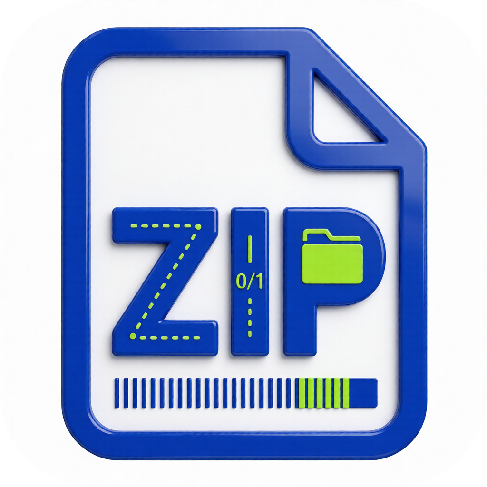

# ZipBloat-Android

<div align="center">



**轻量级 Android 专属 ZIP 文件体积扩容工具**

[](https://opensource.org/licenses/MIT)
[](https://www.python.org/downloads/)
[](https://www.android.com/)
[](https://github.com/Dl1447/ZipBloat-Android/actions)

[English](README_EN.md) | 简体中文

</div>

---

## 项目简介

ZipBloat-Android 是一个专为移动场景设计的 ZIP 文件体积扩容工具，可将 ZIP 文件精准扩容至 1GB~100GB。内置 4 种扩容策略，支持触摸优化界面、动态存储权限管理、移动端文件选择器，兼容内部存储与 SD 卡，操作简单直观。

## 功能特性

### 核心功能

- 📁 **4种扩容策略**：
  - 添加空块：在 ZIP 中添加大量空文件
  - 嵌套 ZIP：创建多层嵌套的 ZIP 结构
  - 尾部追加垃圾数据：在 ZIP 文件尾部追加垃圾数据
  - ZIP 炸弹模式：生成体积很小但解压后会爆炸的 ZIP

- 🌍 **多语言支持**：中文和英文界面，一键切换

- 📊 **实时进度显示**：带百分比的进度条，实时了解生成进度

- ⚡ **操作防抖**：防止快速点击多次触发任务

- ❌ **支持取消**：生成过程中可以随时取消操作

- 📖 **内置帮助**：详细的使用说明和关于信息

### Android 特性

- 📱 **触摸优化界面**：基于 Kivy 框架，专为移动设备设计

- 🔐 **动态权限管理**：自动请求存储权限

- 📂 **移动端文件选择器**：使用 Android Storage Access Framework

- 💾 **灵活的存储选项**：支持内部存储和外部存储（SD卡）

### CI/CD

- 🚀 **GitHub Actions 自动构建**：自动编译、签名并发布 APK

- 📦 **自动化发布**：推送到 main 分支时自动创建 Release

## 快速开始

### 方法 1：使用预编译 APK（推荐）

1. 从项目 [Release 页面](https://github.com/Dl1447/ZipBloat-Android/releases) 下载最新的 APK 文件
2. 在 Android 设备上安装 APK
3. 授予存储权限
4. 打开应用即可使用

### 方法 2：自行编译 APK

#### 环境准备

```bash
# 安装依赖
pip install buildozer
pip install -r requirements.txt
```

#### 编译 APK

```bash
# 初始化 buildozer（首次使用）
buildozer init

# 编译调试版 APK
buildozer android debug

# 编译发布版 APK
buildozer android release

# 生成的 APK 位于 bin/ 目录
```

### 方法 3：使用 GitHub Actions

本项目已配置 GitHub Actions 自动构建，你可以：

1. Fork 本项目
2. 在 GitHub 仓库的 **Settings → Secrets and variables → Actions** 中配置以下密钥：
   - `KEYSTORE_BASE64`: Base64 编码的 keystore 文件内容
   - `KEY_ALIAS`: keystore 中的密钥别名
3. 推送代码到 main 分支，GitHub Actions 将自动构建并签名 APK
4. 构建完成后，APK 会自动上传到 Release 页面

### 方法 4：在 Android 设备上直接运行

1. 安装 [Kivy Launcher](https://play.google.com/store/apps/details?id=org.kivy.pygame) 应用
2. 将项目文件复制到 Android 设备的 `/sdcard/kivy/zipbloat/` 目录
3. 在 Kivy Launcher 中启动应用

## 使用指南

1. **选择原 ZIP 文件**：点击「选择文件」按钮选择需要放大的 ZIP 文件
2. **设置输出路径**：点击「选择输出」按钮设置输出文件路径
3. **设置目标体积**：输入需要放大到的目标体积（GB）
4. **选择放大方式**：从下拉菜单中选择合适的放大方式
5. **点击开始生成**：等待生成完成
6. **查看结果**：生成完成后会显示成功消息

## 扩容策略说明

| 策略 | 说明 | 适用场景 |
|------|------|----------|
| 添加空块 | 在 ZIP 文件中添加大量空文件 | 常规测试 |
| 嵌套 ZIP | 创建多层嵌套的 ZIP 结构 | 需要小体积大解压 |
| 尾部追加垃圾数据 | 在 ZIP 文件尾部追加垃圾数据 | 最稳定可靠 |
| ZIP 炸弹模式 | 生成体积很小但解压后会爆炸的 ZIP | 测试解压防护 |

## 项目结构

```
ZipBloat-Android/
├── .github/
│   └── workflows/
│       └── build-android.yml    # GitHub Actions 自动构建配置
├── android/                     # Android 特定模块
│   ├── permissions.py           # 权限管理封装
│   └── storage.py               # 存储访问封装
├── ZipBloat_Android.py          # Android 版主程序
├── main.py                      # Android 版入口文件
├── buildozer.spec               # Buildozer 配置文件
├── requirements.txt             # Python 依赖
├── README.md                    # 项目说明文档
├── README_EN.md                 # 英文说明文档
├── LICENSE                      # 开源协议
├── ZipBloat.png                 # 应用图标
└── icon.ico                     # 应用图标文件
```

## 技术栈

- **GUI 框架**: Kivy 2.0+
- **打包工具**: Buildozer
- **Python 版本**: 3.7+
- **CI/CD**: GitHub Actions
- **主要特性**: 触摸优化界面，移动端文件选择器
- **权限管理**: 动态请求存储权限
- **文件访问**: 使用 Android Storage Access Framework

## 系统要求

- Android 5.0+ (API 21+)
- 足够的存储空间
- 存储权限

## 注意事项

- ⚠️ 目标体积建议设置在 1-20GB 之间，过大会耗时较长
- ⚠️ 确保输出路径有写入权限
- ⚠️ 使用 ZIP 炸弹模式时请谨慎，仅用于测试目的
- ⚠️ 首次运行需要授予存储权限
- ⚠️ 建议在 WiFi 环境下生成大文件，避免消耗移动数据
- ⚠️ 生成大文件时请确保设备有足够的电量
- ⚠️ 建议使用外部存储（SD 卡）来存储大文件
- ⚠️ 在后台运行时可能会被系统杀死，建议保持应用在前台

## 常见问题

**Q: 应用无法打开文件？**
A: 请确保已授予存储权限，在设置中检查应用权限

**Q: 生成过程中应用崩溃？**
A: 可能是内存不足，建议减小目标体积或关闭其他应用

**Q: 无法找到生成的文件？**
A: 生成的文件默认保存在选择输出路径时指定的位置，可以使用文件管理器搜索

**Q: APK 安装失败？**
A: 请确保已启用"未知来源"应用安装，在设置中允许安装未知应用

**Q: 编译 APK 时出错？**
A: 请确保已安装所有依赖，并检查 buildozer.spec 配置是否正确

**Q: GitHub Actions 构建失败？**
A: 请检查是否正确配置了 GitHub Secrets（KEYSTORE_BASE64 和 KEY_ALIAS）

## 开发指南

### 本地测试

在电脑上测试 Android 版界面：
```bash
pip install kivy
python ZipBloat_Android.py
```

### 修改 buildozer 配置

编辑 `buildozer.spec` 文件来定制 APK：
- 修改应用名称、包名
- 调整 Android API 版本
- 添加额外的权限
- 自定义应用图标和启动画面

### 添加新功能

1. 在 `ZipBloat_Android.py` 中修改 GUI 界面
2. 在 `ZipBloatLogic` 类中添加业务逻辑
3. 更新 `buildozer.spec` 如果需要新的依赖
4. 重新编译 APK 进行测试

### 配置 GitHub Actions

如需使用 GitHub Actions 自动构建，请：

1. 将 keystore 文件转换为 Base64：
   ```bash
   base64 -w 0 your-release.keystore
   ```

2. 在 GitHub 仓库的 **Settings → Secrets and variables → Actions** 中添加：
   - `KEYSTORE_BASE64`: 上一步输出的 Base64 字符串
   - `KEY_ALIAS`: keystore 中的密钥别名
   - `KEY_PASSWORD`: 密钥密码（默认为 dl203904）

3. 推送代码到 main 分支，GitHub Actions 将自动构建并发布 APK

## 贡献指南

欢迎提交 Issue 和 Pull Request 来改进这个项目！

1. Fork 本项目
2. 创建你的特性分支 (`git checkout -b feature/AmazingFeature`)
3. 提交你的更改 (`git commit -m 'Add some AmazingFeature'`)
4. 推送到分支 (`git push origin feature/AmazingFeature`)
5. 开启一个 Pull Request

## 开源协议

本项目采用 [MIT 开源协议](LICENSE)

## 作者信息

- **作者**: Geekline
- **官网**: [geekline.pages.dev](https://geekline.pages.dev)
- **版本**: 1.0

## 免责声明

本工具仅用于合法的测试和学习目的，请勿用于任何恶意用途。使用本工具造成的任何后果，作者不承担任何责任。

---

<div align="center">

**如果这个项目对你有帮助，请给个 ⭐️ Star 支持一下！**

Made with ❤️ by Geekline

</div>
